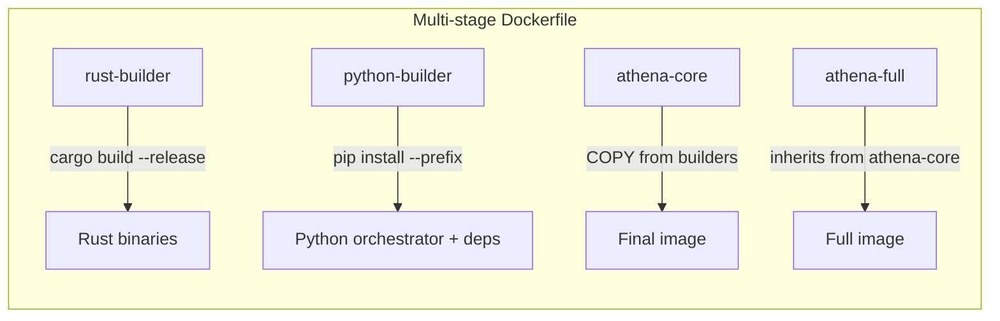
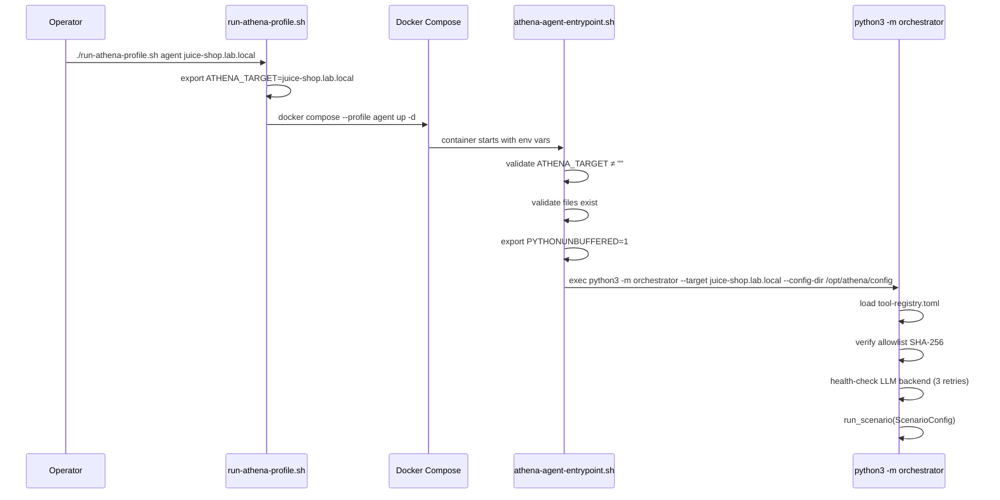

# Design Document: Athena Agent Runtime Wiring

## Overview

This design wires the `athena-agents` OPAR orchestrator into the `nexus-athena` Docker image so that `./scripts/run-athena-profile.sh agent` launches the autonomous observe/plan/act/reflect loop against a configured target. The current agent compose services run `sleep infinity` — this feature replaces that with a proper entrypoint that bootstraps the Python orchestrator with configuration, safety controls, and ground-truth emission.

The implementation spans four layers:
1. **Dockerfile** — new build stages to compile Rust binaries and install the Python orchestrator into the final image.
2. **Entrypoint script** — a shell script that validates the environment (required vars, files) before `exec`ing into `python3 -m orchestrator`.
3. **Compose profiles** — updated `athena.agent` and `athena.agent-ics` services with volume mounts, environment variables, and the new entrypoint command.
4. **Run script** — enhanced `run-athena-profile.sh` that accepts a target argument and passes it through.

The orchestrator code itself (OPAR loop, safety controls, tool registry, ground-truth emitter) already exists in `athena-agents` — this feature packages and wires it for container execution.

## Architecture

```mermaid
graph TD
    subgraph "Host / Operator"
        RS[run-athena-profile.sh agent target-name]
        CFG[./config/ directory]
        OLLAMA[Ollama LLM Backend :11434]
    end

    subgraph "Docker Compose"
        RS -->|docker compose up| SVC[athena.agent service]
        CFG -->|bind mount| VOL_CFG[/opt/athena/config]
        SVC -->|named volume| VOL_OUT[/opt/athena/output]
    end

    subgraph "nexus-athena container"
        EP[athena-agent-entrypoint.sh]
        EP -->|validates env & files| OPAR[python3 -m orchestrator]
        OPAR -->|reads| VOL_CFG
        OPAR -->|writes GT JSONL| VOL_OUT
        OPAR -->|HTTP| OLLAMA
        OPAR -->|subprocess| BINS[athena-scanner / athena-fuzzer / athena-crafter / athena-modbus / athena-canbus]
    end
```

### Build Pipeline



## Components and Interfaces

### 1. Dockerfile Build Stages

**New stages inserted before the existing `athena-core` stage:**

| Stage | Base Image | Purpose | Outputs |
|-------|-----------|---------|---------|
| `rust-builder` | `rust:1.77-slim-bookworm` | Compile all Rust crates from `athena-agents/crates/` | `/usr/local/bin/athena-{scanner,fuzzer,crafter,modbus,canbus}` |
| `python-builder` | `python:3.11-slim-bookworm` | Install `athena-agents` Python package with pinned deps | `/install/lib/python3.11/site-packages/` |

**Modifications to existing stages:**

- `athena-core`: COPY Rust binaries from `rust-builder`, COPY Python site-packages from `python-builder`, COPY entrypoint script.
- `athena-full`: Inherits everything from `athena-core` (no additional agent-specific changes needed).

**Build arguments:**

| Arg | Default | Description |
|-----|---------|-------------|
| `ATHENA_AGENTS_PATH` | `./athena-agents` | Path to the athena-agents source tree in build context |

**Design decisions:**
- Rust cross-compilation uses `TARGETPLATFORM` for multi-arch support (amd64/arm64). The `rust-builder` stage uses `--target` based on buildx platform.
- Python deps are installed with `--require-hashes` from a lockfile (`requirements.lock`) generated by `pip-compile` for reproducibility.
- Dev dependencies (`pytest`, `hypothesis`, `ruff`) are excluded from the install by installing only the main package extras.
- The config directory is NOT baked into the image — it's runtime-mounted. This allows operators to swap targets and allowlists without rebuilding.

### 2. Entrypoint Script (`scripts/athena-agent-entrypoint.sh`)

The entrypoint script is the bridge between the container lifecycle and the Python orchestrator. It validates preconditions and provides clear error messages for misconfigurations.

**Interface:**

```bash
athena-agent-entrypoint.sh [--dry-run]
```

**Environment variables consumed:**

| Variable | Required | Default | Description |
|----------|----------|---------|-------------|
| `ATHENA_TARGET` | Yes | — | Target identifier matching a file in `targets/` |
| `ATHENA_CONFIG_DIR` | No | `/opt/athena/config` | Root config directory |
| `ATHENA_TOOL_REGISTRY` | Yes | — | Path to `tool-registry.toml` |
| `ATHENA_ALLOWLIST` | Yes | — | Path to `allowlist.json` |
| `ATHENA_GT_OUTPUT` | No | `/opt/athena/output/ground-truth.jsonl` | Ground-truth output path |
| `ATHENA_CAPABILITIES` | No | `""` | Comma-separated capability list |
| `ATHENA_SCENARIO_LABEL` | No | `""` | Scenario label for traffic tagging |
| `OLLAMA_HOST` | No | `http://host.docker.internal:11434` | LLM backend URL |
| `PYTHONUNBUFFERED` | Set by script | `1` | Force unbuffered Python I/O |

**Validation sequence:**

1. Check `ATHENA_TARGET` is non-empty.
2. Check `ATHENA_TOOL_REGISTRY` is non-empty and file exists on disk.
3. Check `ATHENA_ALLOWLIST` is non-empty and file exists on disk.
4. Check `${ATHENA_CONFIG_DIR}/allowlist.sha256` exists.
5. Check target config file exists at `${ATHENA_CONFIG_DIR}/targets/${ATHENA_TARGET}.toml`.
6. Set `PYTHONUNBUFFERED=1`.
7. If `--dry-run`: print validated config summary and exit 0.
8. Otherwise: `exec python3 -m orchestrator --target "${ATHENA_TARGET}" --config-dir "${ATHENA_CONFIG_DIR}"`.

**Error output format:**

```
ERROR: [athena-agent-entrypoint] <description>
  Expected: <what was expected>
  Got: <what was found>
```

### 3. Python `__main__.py` Module

A new `orchestrator/__main__.py` must be created to support `python3 -m orchestrator` invocation. This module:

- Parses CLI arguments (`--target`, `--config-dir`).
- Loads `llm.toml` and constructs the appropriate `LLMBackend` instance (Ollama/vLLM/llama.cpp).
- Loads `tool-registry.toml` via `ToolRegistry.load()`.
- Reads `allowlist.sha256` for the expected hash value.
- Reads `ATHENA_CAPABILITIES` from environment and splits on comma.
- Reads `ATHENA_SCENARIO_LABEL` from environment.
- Constructs `GroundTruthEmitter` (respects `ATHENA_GT_OUTPUT` env var).
- Constructs `RateLimiter` with parameters from `llm.toml` or defaults.
- Constructs `AgentOrchestrator` with all dependencies.
- Performs LLM health check with retry (3 attempts, exponential backoff: 1s, 2s, 4s).
- Constructs `ScenarioConfig` and calls `orchestrator.run_scenario()`.
- Writes final `ScenarioResult` summary record to ground-truth output.
- Exits with code 0 on success, non-zero on failure.

**Note:** This module lives in `athena-agents` and is packaged into `nexus-athena` at build time. Its creation is part of this feature's implementation scope.

### 4. Compose Profile Updates (`deploy/compose/athena-profiles.yml`)

**Changes to `athena.agent`:**

```yaml
athena.agent:
  image: ${ATHENA_IMAGE:-phoenixvlabs/nexus-athena:latest}
  container_name: athena.agent
  hostname: athena-agent
  tty: true
  stdin_open: true
  command: ["/usr/local/bin/athena-agent-entrypoint.sh"]
  security_opt:
    - no-new-privileges:true
  cap_drop:
    - ALL
  environment:
    - OLLAMA_HOST=${OLLAMA_HOST:-http://host.docker.internal:11434}
    - ATHENA_CONFIG_DIR=/opt/athena/config
    - ATHENA_TOOL_REGISTRY=/opt/athena/config/tool-registry.toml
    - ATHENA_ALLOWLIST=/opt/athena/config/allowlist.json
    - ATHENA_SCENARIO_LABEL=${ATHENA_SCENARIO_LABEL:-}
    - ATHENA_TARGET=${ATHENA_TARGET:-}
    - ATHENA_GT_OUTPUT=/opt/athena/output/ground-truth.jsonl
  volumes:
    - ${ATHENA_CONFIG_PATH:-./config}:/opt/athena/config:ro
    - athena_output:/opt/athena/output
  networks:
    - athena_lab
  extra_hosts:
    - "host.docker.internal:host-gateway"
  profiles:
    - agent
```

**Changes to `athena.agent-ics`:**

Same as `athena.agent` with additions:
- `cap_add: [NET_RAW]`
- Additional env var: `ATHENA_CAPABILITIES=ICS_WRITE,CAN_INJECT`

**New top-level `volumes` section:**

```yaml
volumes:
  athena_output:
    driver: local
```

### 5. Run Script Updates (`scripts/run-athena-profile.sh`)

**New behavior for `agent` and `agent-ics` profiles:**

```bash
agent)
  TARGET="${2:-${ATHENA_TARGET:-}}"
  export ATHENA_TARGET="${TARGET}"
  echo "Starting Athena agent profile (LLM OPAR mode)..."
  echo "  Target: ${ATHENA_TARGET:-<not set — entrypoint will reject>}"
  echo "  OLLAMA_HOST=${OLLAMA_HOST:-http://host.docker.internal:11434}"
  docker compose --profile agent -f "${COMPOSE_FILE}" up -d athena.agent
  ;;
```

The second positional argument becomes `ATHENA_TARGET`. If omitted, the existing `ATHENA_TARGET` environment variable passes through (which may be empty — the entrypoint will catch this and exit with a clear error).

### 6. Configuration Volume Layout

The operator provides a config directory (default: `./config/` relative to repo root) with:

```
config/
├── tool-registry.toml      # Tool executable mappings and schemas
├── allowlist.json           # Approved targets with port ranges
├── allowlist.sha256         # SHA-256 of allowlist.json (one hex string)
├── llm.toml                # LLM backend configuration
└── targets/
    ├── juice-shop.toml     # Per-target scenario config
    ├── dvwa.toml
    └── ...
```

This directory is bind-mounted read-only at `/opt/athena/config`. The `athena-agents` repo already has this exact structure in its `config/` directory, so operators using both repos together get zero-config alignment.

## Data Models

### Environment Variable Flow



### Ground-Truth Output Format

Each line in `/opt/athena/output/ground-truth.jsonl` is a JSON object:

```json
{
  "scenario_id": "uuid",
  "run_id": "uuid",
  "timestamp": "2024-01-15T10:30:00.000Z",
  "target": "juice-shop.lab.local",
  "payload_family": "sqli",
  "technique": "union-select",
  "expected_result": "SQL injection via union query",
  "safety_boundary": "lab-network-only",
  "label": "malicious",
  "artifact_reference": ""
}
```

The final record has `label: "scenario_complete"` with the `ScenarioResult` termination reason in `expected_result`.

### Volume Mounts Summary

| Mount | Source | Target | Mode | Purpose |
|-------|--------|--------|------|---------|
| Config | `${ATHENA_CONFIG_PATH:-./config}` | `/opt/athena/config` | `ro` | Tool registry, allowlist, LLM config, targets |
| Output | `athena_output` (named volume) | `/opt/athena/output` | `rw` | Ground-truth JSONL output |

## Error Handling

### Entrypoint Validation Errors (Exit Code 1)

| Condition | Error Message | Recovery |
|-----------|--------------|----------|
| `ATHENA_TARGET` empty | `ATHENA_TARGET not set` | Set env var or pass target as arg to run script |
| `ATHENA_TOOL_REGISTRY` empty | `ATHENA_TOOL_REGISTRY not set` | Ensure compose env is correct |
| Tool registry file missing | `Tool registry file not found: <path>` | Mount config volume correctly |
| Allowlist file missing | `Allowlist file not found: <path>` | Mount config volume correctly |
| Allowlist SHA-256 file missing | `Allowlist hash file not found: <path>` | Generate with `sha256sum allowlist.json > allowlist.sha256` |
| Target config missing | `Target config not found: <path>` | Create target TOML in `config/targets/` |

### Orchestrator Runtime Errors (Exit Code Non-Zero)

| Condition | Behavior | Ground-Truth Record |
|-----------|----------|---------------------|
| Allowlist hash mismatch | Log error, exit | `needs_review` record |
| LLM backend unreachable after 3 retries | Log error, exit | None (pre-scenario) |
| Target unreachable (TCP) | Log error, exit | `needs_review` record |
| Rate limit exceeded | Halt scenario | Final summary with `rate-limited` |
| Boundary violation | Halt immediately | `needs_review` record |
| Capability mismatch | Skip tool, continue | Action recorded as `skipped` |

### Container Lifecycle

- **Healthy start**: Entrypoint validates → orchestrator runs scenario → writes final summary → exits 0.
- **Validation failure**: Entrypoint prints structured error → exits 1 → container stops → `docker logs` shows the error.
- **Runtime failure**: Orchestrator catches error → emits `needs_review` ground-truth → exits non-zero.
- **Operator interruption**: `docker stop` sends SIGTERM → Python handles gracefully (asyncio cancellation) → partial ground-truth remains on volume.

## Testing Strategy

### Why Property-Based Testing Does NOT Apply

This feature is primarily infrastructure wiring:
- **Dockerfile stages** are declarative build instructions — correctness is verified by building the image and running acceptance checks.
- **Shell entrypoint script** is a sequential validation pipeline with discrete pass/fail conditions — not a function with a large input space.
- **Compose YAML** is declarative configuration — verified by schema validation and `docker compose config`.
- **Run script** is a thin CLI wrapper — tested by invocation with specific arguments.

The logic that would benefit from PBT (allowlist verification, rate limiting, capability matching, ground-truth serialization) already exists in `athena-agents` and has its own property-based test suite. This feature packages and configures that existing code — it doesn't introduce new algorithmic logic.

### Testing Approach

#### Unit Tests (pytest)

- `orchestrator/__main__.py` CLI argument parsing (specific examples).
- LLM health-check retry logic with mocked `httpx` client.
- Configuration loading integration (tool-registry, allowlist, llm.toml).

#### Integration Tests (shell-based)

- **Entrypoint validation**: Run `athena-agent-entrypoint.sh --dry-run` with various env var combinations. Assert exit codes and error messages.
- **Missing file detection**: Mount incomplete config volume, verify structured error output.
- **End-to-end boot**: Start `athena.agent` with a mock LLM endpoint, verify the orchestrator initializes and writes a ground-truth record.

#### Smoke Tests (Docker build + container start)

- Build image successfully with `docker buildx build --target athena-core .`
- Verify Rust binaries are present: `docker run --rm <image> ls /usr/local/bin/athena-*`
- Verify Python module is importable: `docker run --rm <image> python3 -c "import orchestrator"`
- Verify entrypoint is executable: `docker run --rm <image> test -x /usr/local/bin/athena-agent-entrypoint.sh`
- Run `docker compose config` on the updated compose file to validate YAML syntax.

#### Acceptance Gate

Extend `scripts/validate-analyst-image.sh` (or create a parallel `validate-agent-image.sh`) to verify:
1. All Rust binaries exist and are executable.
2. `python3 -m orchestrator --help` succeeds (once `__main__.py` is implemented).
3. Entrypoint `--dry-run` succeeds when given valid config.
4. Container starts and exits cleanly with a mock target.

### Test Configuration

- Unit tests: `pytest tests/python/` in `athena-agents` repo.
- Integration tests: Shell scripts in `nexus-athena/tests/integration/`.
- Smoke tests: Part of CI pipeline after image build.
- No watch mode — all tests run to completion via `make test` or CI.
