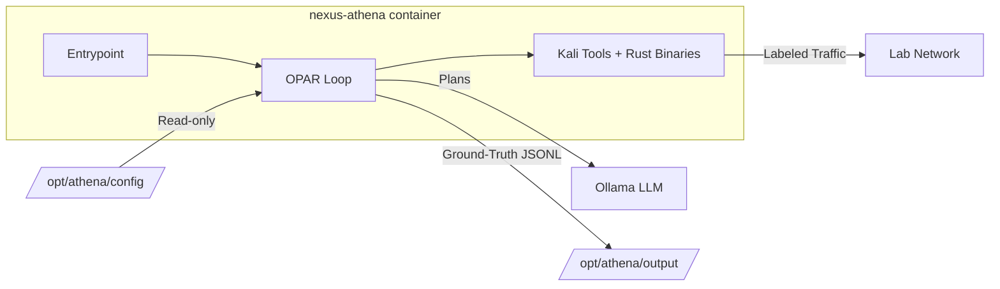

# Nexus Athena

Controlled red-team and adversary emulation container for Underground Nexus. Generates labeled attack traffic against approved targets for SOC validation, detection engineering, and AI-SOC model evaluation.

Also serves as the execution environment for [athena-agents](https://github.com/phoenixvlabs/athena-agents) — the LLM-driven OPAR (Observe/Plan/Act/Reflect) loop.

## Quick Start

```bash
# Build the image (requires ../athena-agents repo adjacent)
./scripts/build-athena-image.sh

# Run manual red-team (standard profile)
./scripts/run-athena-profile.sh standard

# Run LLM agent against a target
./scripts/run-athena-profile.sh agent juice-shop

# Run ICS agent with safe-range enforcement
./scripts/run-athena-profile.sh agent-ics openplc

# Check status
./scripts/run-athena-profile.sh status

# Tear down
./scripts/run-athena-profile.sh down
```

## Runtime Profiles

| Profile | Command | Capabilities | Purpose |
|---------|---------|-------------|---------|
| `standard` | `/bin/bash` | Unprivileged | Manual red-team commands |
| `packet-lab` | `/bin/bash` | NET_ADMIN, NET_RAW | Packet capture, Wireshark |
| `exploit-lab` | `/bin/bash` | NET_ADMIN, NET_RAW, SYS_PTRACE | Metasploit, exploit dev |
| `agent` | OPAR entrypoint | Network to LLM | LLM-driven autonomous emulation |
| `agent-ics` | OPAR entrypoint | NET_RAW + ICS_WRITE, CAN_INJECT | Autonomous ICS/OT testing |

## Architecture



See [architecture.md](architecture.md) for the full design including LLM agent integration (Section 5).

## Build

The unified multi-stage Dockerfile handles both architectures (amd64/arm64) and includes:

- **rust-builder** — compiles Rust tool crates from `athena-agents/crates/`
- **python-builder** — installs the Python OPAR orchestrator
- **athena-core** — Kali base + recon tools + agent runtime (recommended)
- **athena-full** — extends core with Metasploit, Wireshark, radare2

```bash
# Build athena-core (fast, ~1.5GB)
./scripts/build-athena-image.sh

# Build athena-full (slower, includes Metasploit + radare2)
./scripts/build-athena-image.sh full

# Custom image tag
IMAGE_TAG=myregistry/athena:dev ./scripts/build-athena-image.sh
```

The build script creates a temp context merging this repo + `athena-agents` (default: `../athena-agents`).

## Agent Configuration

The `config/` directory is mounted read-only into agent containers at `/opt/athena/config`:

```
config/
├── tool-registry.toml      # Available tools with capability gates
├── allowlist.json           # Approved targets (SHA-256 verified)
├── allowlist.sha256         # Integrity hash
├── llm.toml                # LLM backend settings (Ollama/vLLM)
└── targets/
    ├── juice-shop.toml     # Web app pentest scenario
    ├── grimoire.toml       # Grimoire workbench UI (host :4400)
    ├── grimoire-lab.toml   # Grimoire on athena_lab (grimoire.lab:3000)
    └── openplc.toml        # ICS Modbus with safe ranges
```

See [config/README.md](config/README.md) for details.

## Safety Controls

All agent execution enforces:

- **Allowlist verification** — SHA-256 hash checked before every cycle
- **Capability gates** — tools declare required caps, profiles grant them
- **Rate limiting** — per-target token-bucket (configurable in target TOML)
- **Safe-range enforcement** — ICS write operations validated against min/max before transmission
- **Traffic labeling** — `X-Athena-Scenario` + `X-Athena-Run-ID` headers on all outbound requests
- **Human review** — `needs_review` flag halts execution for analyst approval

## Deploy

### Docker Compose

```bash
# All profiles available via the launcher script
./scripts/run-athena-profile.sh {standard|packet-lab|exploit-lab|agent|agent-ics} [target]
```

Compose file: `deploy/compose/athena-profiles.yml`

### Kubernetes

```bash
# Standard profiles
kubectl apply -k deploy/kubernetes/overlays/local

# Agent profile (with LLM egress NetworkPolicy)
kubectl apply -k deploy/kubernetes/overlays/agent
```

### Validation

```bash
# Verify all profiles start correctly and capabilities are enforced
ATHENA_IMAGE=phoenixvlabs/nexus-athena:latest ./scripts/validate-athena-profiles.sh
```

## Cross-Repo Dependencies

| Repository | Relationship |
|------------|-------------|
| `athena-agents` | OPAR orchestrator code (Python + Rust) — required for agent builds |
| `core-nexus` | Architecture hub — this repo must stay aligned |
| `nexus-webtop-soc` | SOC baseline that receives Athena's labeled traffic |

## Supply Chain

- `cosign.pub` — public key for image signature verification

## AI Collaboration

- [AGENTS.md](AGENTS.md) — Agent coding instructions
- [CLAUDE.md](CLAUDE.md) — Architecture critique and security review
- [GEMINI.md](GEMINI.md) — Research and tooling comparison
- [architecture.md](architecture.md) — Canonical architecture guide

## License

[MIT License](LICENSE)
