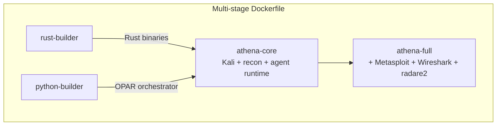
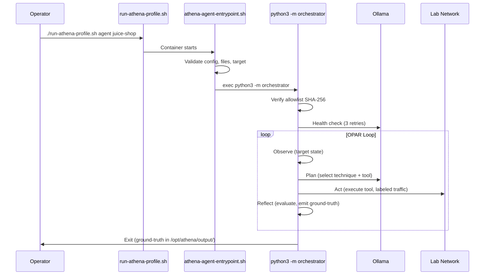

# Nexus Athena Architecture

This document describes the architecture of `nexus-athena` — the controlled red-team and adversary emulation container for Underground Nexus.

## 1. Image Architecture



**athena-core** (recommended for agent use):
- Base: `kalilinux/kali-rolling`
- Tools: Nmap, Python 3, Scapy, tcpdump, curl, git, iproute2
- Agent runtime: Python OPAR orchestrator + Rust tool binaries
- Entrypoint: `athena-agent-entrypoint.sh` (validates config before launching)
- Non-root user: `athena` (UID 1000)
- Multi-platform: amd64 + arm64 via `TARGETPLATFORM`

**athena-full** (extends core):
- Metasploit Framework
- Wireshark (tshark)
- radare2 (pinned version, built from source)

Build with: `./scripts/build-athena-image.sh [athena-core|full]`

## 2. Runtime Profiles

| Profile | Command | Capabilities | Network | Use case |
|---------|---------|-------------|---------|----------|
| `standard` | `/bin/bash` | None (all dropped) | athena_lab | Manual red-team |
| `packet-lab` | `/bin/bash` | NET_ADMIN, NET_RAW | athena_lab | Packet capture |
| `exploit-lab` | `/bin/bash` | NET_ADMIN, NET_RAW, SYS_PTRACE | athena_lab | Exploit dev |
| `agent` | Entrypoint → OPAR | None + LLM egress | athena_lab + host | Autonomous emulation |
| `agent-ics` | Entrypoint → OPAR | NET_RAW + ICS env vars | athena_lab + host | ICS/OT testing |

All profiles:
- `cap_drop: ALL` as baseline
- `no-new-privileges: true`
- Isolated on `athena_lab` bridge network
- No Docker socket access

Agent profiles additionally:
- Mount `config/` read-only at `/opt/athena/config`
- Named volume `athena_output` at `/opt/athena/output` for ground-truth
- `extra_hosts: host.docker.internal` for LLM endpoint access
- Environment: `ATHENA_TARGET`, `OLLAMA_HOST`, `ATHENA_CAPABILITIES`

## 3. Agent Execution Flow



## 4. Safety Controls

| Control | Layer | Enforcement |
|---------|-------|-------------|
| Allowlist verification | Entrypoint + orchestrator | SHA-256 hash checked before any execution |
| Capability gates | Tool registry + profile | Tools declare required caps; profile must provide them |
| Rate limiting | Orchestrator | Per-target token-bucket (configured in target TOML) |
| Safe-range validation | Orchestrator | ICS write values checked against min/max before transmission |
| Traffic labeling | Orchestrator + tools | `X-Athena-Scenario` + `X-Athena-Run-ID` on all outbound |
| Human review | Orchestrator | `needs_review` flag halts loop for analyst decision |
| Max actions | Orchestrator | Configurable limit (1-1000) prevents runaway |
| Network isolation | Compose/K8s | NetworkPolicy restricts egress to approved targets + LLM |

## 5. Configuration

The `config/` directory (mounted read-only in agent containers):

| File | Purpose |
|------|---------|
| `tool-registry.toml` | Tool definitions with argument schemas and capability requirements |
| `allowlist.json` | Approved targets with ports (SHA-256 verified) |
| `allowlist.sha256` | Integrity hash |
| `llm.toml` | LLM backend config (model, URL, rate limits) |
| `targets/*.toml` | Per-target scenario configs (host, port, safe ranges, max actions) |

See [config/README.md](config/README.md) for adding targets.

## 6. Deployment

### Docker Compose

```bash
./scripts/run-athena-profile.sh {standard|packet-lab|exploit-lab|agent|agent-ics} [target]
```

Compose file: `deploy/compose/athena-profiles.yml`

### Kubernetes

| Overlay | Purpose |
|---------|---------|
| `overlays/local` | Local k3d development |
| `overlays/prod` | Production deployment |
| `overlays/agent` | Agent profile with LLM egress NetworkPolicy |

```bash
kubectl apply -k deploy/kubernetes/overlays/agent
```

## 7. Skill Persistence

After autonomous scenarios complete, approaches are encoded as reusable skills:

- **Development**: `~/.kiro/skills/` via auto-skill-gen hook
- **Platform**: MinIO `nexus-memory/skills/` (synced via `scripts/sync-skills.sh` in core-nexus)
- **Loading**: Skills injected into OPAR Plan phase context, reducing token spend on repeat scenarios

## 8. Cross-References

| Document | Location |
|----------|----------|
| Athena evolution roadmap | `core-nexus/docs/architecture/08-athena-adversary-fuzzer.md` |
| LLM stimulation/emulation | `core-nexus/docs/architecture/11-ai-native-integration-principles.md` Section 4 |
| Agent workflows and memory | `core-nexus/docs/architecture/13-agent-workflows-and-memory.md` |
| OPAR implementation | `athena-agents/orchestrator/agent.py` |
| Platform component definition | `core-nexus/platform/athena/README.md` |
