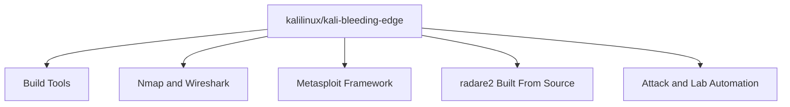
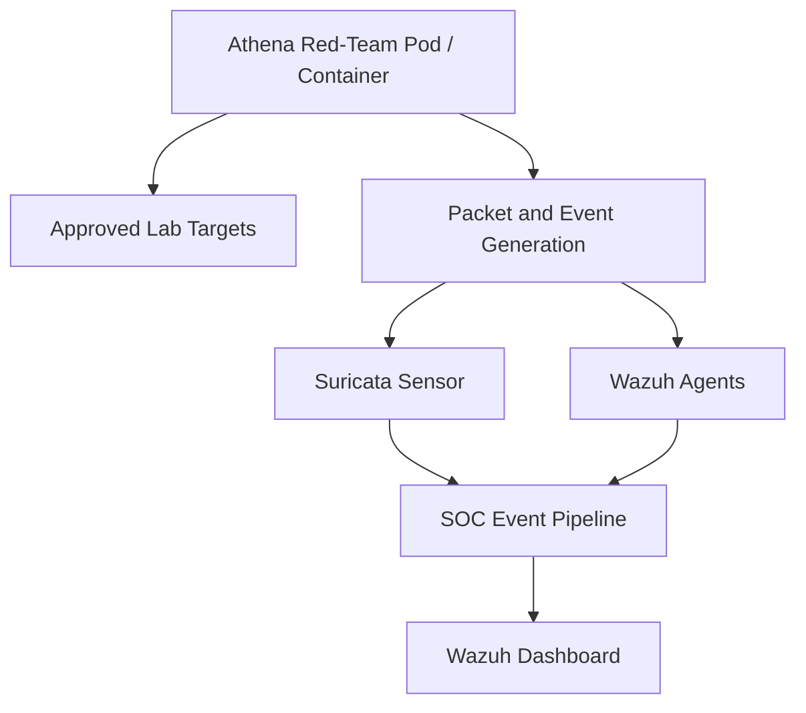
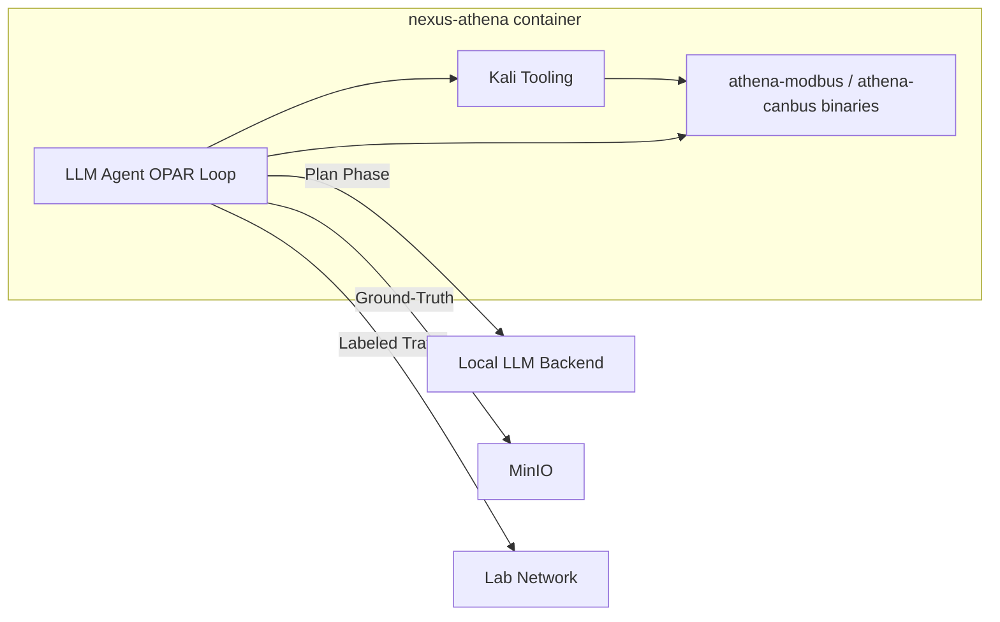

# Nexus Athena Proposed Architecture

This document reviews the current `nexus-athena` image and proposes its role in the revised Underground Nexus architecture.

`nexus-athena` should remain the controlled red-team and security testing environment. It should not become part of the SOC control plane, and it should not share broad Docker host access unless a specific lab requires it.

## 1. Current Image

Current characteristics:

- Provides separate `amd64` and `arm64` Dockerfiles.
- Uses `kalilinux/kali-bleeding-edge` as the base image.
- Installs offensive and analysis tools such as Nmap, Wireshark, Metasploit Framework, and radare2.
- Builds radare2 from the upstream repository at build time.
- Keeps Terraform out of the default image and prefers Workbench for infrastructure tooling.
- Declares shared volumes for `/var/run`, `/var/lib/docker/volumes`, and `/nexus-bucket`.

## 2. Target Role

Target characteristics:

- Runs only in isolated lab networks.
- Generates controlled attack and test traffic for SOC validation.
- Produces repeatable scenarios for Security+ and AI-assisted detection labs.
- Uses explicit network policies to limit what Athena can reach.
- Keeps offensive tooling separate from analyst workbench and SOC services.

## 3. Architecture Recommendations

- Keep Kali as the base for Athena. Chainguard images are a better fit for production services, not for a Kali-based offensive tooling environment.
- Split `amd64` and `arm64` differences into one multi-platform build definition if possible.
- Pin package versions where practical, especially for tools used in repeatable labs.
- Avoid building radare2 directly from a moving branch unless the lab intentionally needs latest upstream behavior.
- Avoid mounting the Docker socket or host Docker paths by default.
- Document which capabilities are required for Wireshark, packet capture, and Metasploit use cases.
- Run Athena with namespace and network isolation by default.

## 4. Open Design Decisions

| Decision | Recommended default | Rationale |
| --- | --- | --- |
| Access method | Do not expose SSH by default; use Docker exec, Kubernetes exec, or a controlled terminal | Reduces exposed services in the red-team container. |
| Packet capture permissions | Grant only for labs that require capture | Capabilities such as `NET_ADMIN` and `NET_RAW` should be explicit. |
| Terraform location | Move Terraform to Workbench by default | Athena should focus on red-team and lab traffic generation. |
| Default tool set | Keep a small Kali baseline with optional lab-specific layers | Reduces image size and makes labs more repeatable. |
| Traffic labeling | Add scenario labels through environment variables and output paths | SOC dashboards should distinguish training traffic from real alerts. |
| Host Docker access | Disabled by default | Docker socket access is too broad for normal Athena use. |

Recommended profiles:

| Profile | Purpose | Privilege level |
| --- | --- | --- |
| `athena-standard` | Basic red-team commands against approved lab targets | Unprivileged or minimal capabilities |
| `athena-packet-lab` | Wireshark, packet capture, network analysis | Explicit network capabilities |
| `athena-exploit-lab` | Metasploit or attack simulation labs | Isolated network, explicit approval |

## 5. LLM Agent Integration

The `nexus-athena` container serves as the execution environment for LLM-driven adversary emulation agents implemented in `athena-agents`.

### How It Works

The LLM agent orchestrator (`athena-agents/orchestrator/`) runs inside or alongside the Athena container, using Kali tools and custom Rust binaries as its action primitives. The LLM backend (Ollama, vLLM, or llama.cpp) provides the planning intelligence.

### Execution Modes

| Mode | Description | Use case |
| --- | --- | --- |
| Manual | Analyst drives Athena tools directly via CLI | Traditional red-team labs, Security+ scenarios |
| Scripted | Pre-defined scenario replay with deterministic sequencing | Regression testing, repeatable SOC validation |
| Autonomous (LLM) | OPAR loop with LLM planning, safety controls, and ground-truth emission | Adaptive stimulation, adversary emulation, coverage gap discovery |

### Requirements for LLM Agent Mode

- Network access to the LLM inference endpoint (Ollama at `localhost:11434` or configured vLLM/llama.cpp URL).
- Access to `config/tool-registry.toml` and `config/targets/` for tool and target definitions.
- Active runtime profile with appropriate capabilities (e.g., `ICS_WRITE` for Modbus write operations).
- Allowlist JSON accessible and SHA-256 verified before execution.
- Labeled traffic headers (`X-Athena-Scenario`, `X-Athena-Run-ID`) injected into all outbound requests.

### Skill Persistence

After autonomous scenarios complete, agent skills are captured:

- Development: `~/.kiro/skills/` via Kiro auto-skill-gen hook.
- Platform: MinIO artifact store under `skills/<domain>/<descriptor>.md`.
- Skills are loaded into the OPAR Plan phase context on subsequent runs, reducing LLM token spend on previously-solved problems.

### Profile Extension for Agent Mode

| Profile | Purpose | Privilege level |
| --- | --- | --- |
| `athena-agent` | LLM-driven autonomous emulation against approved targets | Same as `athena-standard` + network access to LLM endpoint |
| `athena-agent-ics` | Autonomous ICS/OT testing with safe-range enforcement | `athena-agent` + `ICS_WRITE` / `CAN_INJECT` capabilities |

### Cross-References

- `athena-agents/` repository — full OPAR implementation, tool registry, LLM backends.
- `core-nexus/docs/architecture/08-athena-adversary-fuzzer.md` — Athena evolution roadmap.
- `core-nexus/docs/architecture/11-ai-native-integration-principles.md` Section 4 — LLM agent stimulation and emulation architecture.

## 6. First Implementation Milestone

The first revision should make Athena safer and more repeatable without removing its red-team purpose.

Milestone scope:

- Add a documented runtime profile for Docker and Kubernetes.
- Remove default host Docker mounts from normal operation.
- Add labels and environment variables for lab scenario identity.
- Pin or intentionally track versions for radare2 and any optional tooling layers.
- Document required Linux capabilities for packet capture labs.
